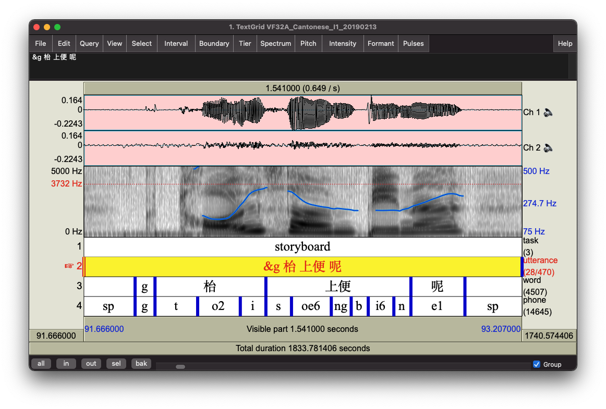

# How the files were transcribed

This page is an extension of the description published in [Johnson, Babel, Fong, & Yiu (2020)](https://www.aclweb.org/anthology/2020.lrec-1.503/), and some of the text from the paper is reproduced verbatim.

---

## Overview

Broadly, the transcription pipeline followed these steps:

1. Files segmented into short chunks, with breaks placed during silences/breaths
2. Initial transcripts produced with Google Cloud Speech-to-Text
3. Hand-correction of orthographic transcripts by bilingual research assistants
4. Force-aligned transcripts produced for segmental content

The tools used in the process were:

- [Praat](https://www.fon.hum.uva.nl/praat/) (version 6+)
- Python libraries: 
    + [`parselmouth`](https://parselmouth.readthedocs.io/)
    + [`pycantonese`](https://pycantonese.org/) 
    + [`jieba`](https://github.com/fxsjy/jieba)
    + [`pydub`](https://pydub.com/)
    + ...and others
- Google Cloud Speech-to-Text [Synchronous speech recognition](https://cloud.google.com/speech-to-text/docs/sync-recognize) (v1)
- [ELAN](https://archive.mpi.nl/tla/elan) (version 5.4+)
- Transcription guidelines were loosely adapted from the [HLVC project](http://projects.chass.utoronto.ca/ngn/HLVC/0_0_home.php)
- [Montreal Forced Aligner 1.0.1](https://montreal-forced-aligner.readthedocs.io/)

## Speech recognition

Google Cloud Speech-to-Text has inexpensive options for both Canadian English (`en-CA`) and Hong Kong Cantonese (`yue-Hant-HK`)&mdash;it was used to produce an initial transcript, with the aim of expediting the orthographic transcription process. Anecdotally, it worked better for English than Cantonese. 

Of the available options, synchronous speech recognition with short audio files was desirable from an ethics perspective, as it allowed for the files remain in local storage rather than cloud storage. The files were sent to the cloud for processing, but were not logged by Google.

To use this option, the audio files were first segmented into short chunks. This was done in Praat, by extracting the participant channel (`Convert - Extract one channel...`), marking silences (`Annotate - To TextGrid (silences)`), and manually adding and correcting such that individual chunks were under 15 seconds in length. This was done to facilitate subsequent manual correction. No attention was paid to constituents at this point, unless they coincided with a silence, pause, or breath. 

Using the timestamps from the Praat textgrid (Praat's annotation file type), short audio files were then extracted and downsampled to 16,000 Hz with `pydub`, and then processed with the Cloud Speech-to-Text Python client. The function used closely resembled that in the Cloud Speech-to-Text documentation for ["Performing synchronous speech recognition on a local file"](https://cloud.google.com/speech-to-text/docs/sync-recognize#speech-sync-recognize-python), copied below for ease of reference. Of the synchronous speech recognition output, both transcription and confidence were retained, and imported into ELAN for manual checking. 

```python
def transcribe_file(speech_file):
    """Transcribe the given audio file."""
    from google.cloud import speech
    import io

    client = speech.SpeechClient()

    with io.open(speech_file, "rb") as audio_file:
        content = audio_file.read()

    audio = speech.RecognitionAudio(content=content)
    config = speech.RecognitionConfig(
        encoding=speech.RecognitionConfig.AudioEncoding.LINEAR16,
        sample_rate_hertz=16000,
        language_code="en-US",
    )

    response = client.recognize(config=config, audio=audio)

    # Each result is for a consecutive portion of the audio. Iterate through
    # them to get the transcripts for the entire audio file.
    for result in response.results:
        # The first alternative is the most likely one for this portion.
        print(u"Transcript: {}".format(result.alternatives[0].transcript))
```

## Orthographic hand correction

Hand correction was done for participant speech in each of the interview files using ELAN. Note that while audible, the interviewer's speech was never transcribed. Further, instances that were considered to directly identify participants were silenced from the audio, and marked with "xxx" in the transcription.

### Conventions

Some conventions apply to both lanugages:

- Transcriptions reflect exactly what was said, as it was said
- The placeholder "xxx" denotes unintelligible (and silenced) speech
- Fragments are transcribed using "&" followed by the fragment produced (e.g., "&s")
- The "?" symbol may mark questions; other punctuation is not used

Cantonese-specific conventions were:

- Where possible, transcription comprises traditional characters
- Words without a standard traditional character are transcribed with Jyutping (e.g., *jyut6ping3*)
- Fully-lexicalized syllable fusion is transcribed with the typical smaller number of characters (e.g., 咩 *me1* is a fully fused version of 乜嘢 *mat1 ye5*, and intermediate version 咩嘢 *me1 ye5*&mdash;all translate to "what")
- Non-lexicalized (or ambiguous) cases of syllable fusion are transcribed with the full number of characters fused (e.g., 朝頭早, "morning," is fully pronounced as *ziu1 tau4 zou2*, but can be fused to【朝頭】早 *ziau14zou2*; brackets indicate the fused syllables)
- Filled pauses are transcribed with the character 㖡 (*e6*), or using Jyutping if different (e.g., *m6*)
- Words produced in Mandarin Chinese are transcribed in Mandarin (simplified) Chinese characters with "@m" appended to each 
- A similar convention applied to other languages, such as "@j" for Japanese, and "@ml" for Malay 
- Code-switches to English were not tagged with the @ symbol, merely written in English
- Numbers are written out in characters or jyutping, *not* using the 0-9 digits

English-specific conventions were:

- Standard spelling was used (likely some variation between US/UK/Canadian spellings)
- Proper nouns are capitalized (and may be hyphenated if composed of multiple words, as with "British-Columbia")
- Filled pauses are transcribed with "um", "er", "uh", and other similar *non*-elongated forms
- Numbers are written out in word form (e.g., "one hundred")

### Cantonese word segmentation

Following orthographic hand-correction, Cantonese text in both the Cantonese and English files was segmented using a minimally adapted version of the [Cantonese Word Segmentation](https://github.com/wchan757/Cantonese_Word_Segmentation) `wordlist.txt` and `jieba` Python package. 

## Forced alignment

Force-aligned transcripts were produced with the Montreal Forced Aligner 1.0.1, using the hand-corrected orthographic transcripts. The English files were aligned with the pretrained English model provided with the Montreal Forced Aligner. The Cantonese files were aligned with the `train_and_align` function, as a pretrained model was not available for Cantonese at the time of the corpus preparation and release. 

For English, an adapted version of the pronunciation dictionary provided with the Montreal Forced Aligner was used, which (while not a perfect choice) broadly reflects North American English varieties.

For Cantonese, a pronunciation dictionary was generated by mapping the segmented characters to their Jyutping romanization with the `pycantonese` Python package, and supplementing it with manual entries (mostly for instances of syllable fusion). In this dictionary, tone numbers are always appended to the syllable nucelus.

While the force aligned transcripts were inspected to ensure that the ouput looked approximately correct, this was a very coarse inspection, and involved no manual correction of the word or phone tiers. Note the English was not aligned in the Cantonese files, and Cantonese was not aligned in the English files.

The acoustic models, pronunciation dictionaries, and out-of-vocabulary files for both languages are included with the SpiCE corpus download.


## The end product

This transcription process led to the following output. For each audio recording, there is an accompanying Praat `.TextGrid` transcript with the same base filename. The transcript includes four tiers, and is pictured in the Praat screenshot below:

- `task`: Marks the portion of the interview as Sentences, Storyboard, or Interview
- `utterance`: The utterance that served as input to forced alignment.
- `word`: English or Cantonese word 
- `phone`: The segment of English or Cantonese as identifed by forced alignment




